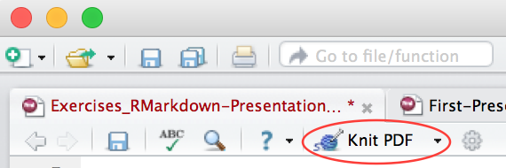
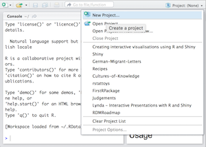

```{r, message=FALSE, warning=FALSE, include=FALSE}
knitr::opts_chunk$set(echo = TRUE)
```

\begin{center}
\section{Exercises: RMarkdown for Presentations}
\end{center}

# Overview of Exercises

These exercises introduce you to the basic of RMarkdown and publishing to the Rpubs platform.

The process of interpreting your RMarkdown files and generating HTML/PDFs out is called "knitting" and uses (amongst other libraries), `knitr`. Knitting documents, and Shiny apps later, is done by pressing the "knit" button shown below - the exact text/image of the button will change dependent on what type of document you're working on.

<center></center>

From this point onwards you are asked to start each new exercise [within reason] as a new project, some sets of exercises require a different project per exercise. In this instance, however, just create one project for these exercises called "RMarkdown" or something similiar.

# Exercises 1: New Script, New Project

Multiple instances of RStudio can be run at once - in RStudio parlence these are called *sessions* and are how you can work on multiple *projects* at once.

- On Windows, it is sometimes difficult to understand the difference between "instances" of applications and multiple windows within the same "instance". In general, RStudio runs in a single window with multiple files. Therefore, separate items in the task bar indicate distinct RStudio sessions.

- On OS X it is easy to differentiate between instances of an application (in general), separate dock itmes mean separate RStudio instances.

The following exercises will assist you in becomming familiar with this paradigm:

1.1. Open a new RStudio session

1.2. Create a new project, using either of the following methods:

- File -> New Project
- The Projects menu in the top-right of the screen



1.2.1 Choose "New Directory" and "Empty Project" 
1.2.2 Browse to the desktop
1.2.3 Give your project a sensible name, like "RMarkdown"

1.3. Create a new script file with the shortcut CTRL+N or from the menubar select File -> New -> R Script

1.4. Type the following into your script file and evaluate it by pressing CTRL+Enter - in the "Environment" section of RStudio you should see that your variable has been assigned to the session environment

```{r}
myVariable <- rep("Hello World", 2)
```

1.4.1 To evaluate *specific lines* in a script, the lines must be selected
1.4.2 If nothing is selected then **only** the line with the cursor in it will be evaluated

1.5. Save the file and close the RStudio instance you opened - say yes to the save prompts

1.6. Reopen the project in a new instance of RStudio - if you have following the instructions correctly, the variable assigned previously will be in the project environment.

## Warning and Sanity Check

Because projects store variables (data, functions and one off assignments) there may be examples of unexpected *old* variable definitions or data polluting your work. When working on large projects, and when attempting to diagnose bugs, it is a wise idea to check your environment and to "clear" the environment if necessary by using the broom icon in the environments panel.

# Exercise 2

Ensure the project you just created is open before beginning this exercise.

2.1. Create a slidy RMarkdown document from File -> New -> RMarkdown

2.2. Change the slide headings to the following:

- Laying out presentations
- Formatting Text
- Including Code in Slides
- Obscuring Code

2.3. Change the 1st and 3rd slide titles to be a heading (#) rather than subheading (##) - how does this change the output presentation file?

# Exercise 3

Images are embedded into RMarkdown files using the following syntax

``

Paths are *relative* to the RMarkdown document.

3.1. Add a new slide to your presentation with the heading "Images"

3.2. Create a subdirectory in the folder where your .Rmd file is saved called "images"

3.3. Save an image of your choice into this directory

3.4. Use the syntax above to embed this image into your new slide.

# Exercise 4

4.1. Add a new slide to the presentation called "Code Chunk"

4.2. Use the keyboard shortcut (Ctrl+Alt+I or Cmd+Alt+I) to insert a new code

4.3. Write a script that will generate a vector of the squares of integers 1 through 10 (inclusive)

4.4. Provide an appropriate code chunk name and option so that the code AND output of the chunk is displayed in your presentation slides

# Exercise 5

5.1. Select a `htmlwidget` example from the previous set of exercises, create a new slide explaining what the `htmlwidget` is about

5.2. Add a code chunk that generates the `htmlwidget`

5.3. Ensure that the document knits together correctly.

# Exercise 6

RPubs provides a free platform for publishing HMTL RMarkdown files, including those with embedded htmlwidget visualisations.  The simplest way to connect your instance of RStudio to RPubs is to already have a HTML RMarkdown file ready - like the one you've just built.

6.1. Knit the presentation file and select "publish" in the top-right of the window, you'll be presented with this dialog - select "Publish"

```{r fig.width=2, fig.height=10,echo=FALSE}
library(png)
library(grid)
img <- readPNG("images/publish-to-RPubs.png")
grid.raster(img)
```

6.2 Your browser will be directed to the "Publish Document - Step 1 of 2" page where you will be asked to create an account. When selecting your username be aware that URLs to your RPubs documents will have the form: rpubs.com/your-fancy-username/your-documents-name

6.3 Register your account and choose an appropriate title, description and slug for your document.

When these steps have been finished you'll have a published slidy presentation on RPubs.


