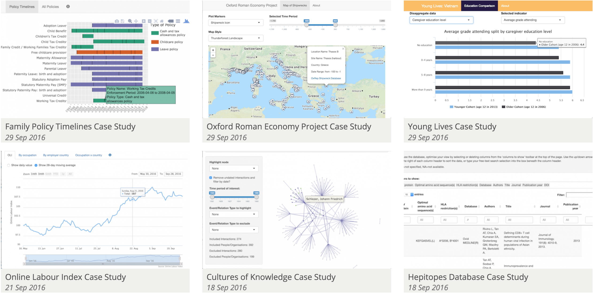

```{r, include=FALSE}
knitr::opts_chunk$set(fig.width=10, fig.height=6, fig.path='Figs/',
                      echo=FALSE, warning=FALSE, message=FALSE)
```

# Course Materials and Structure

This is a quick introduction and overview of what's possible with R (and the RStudio technology stack).

```{r}
timetable <- list(
  "00:00 - 00:30" = "Preamble",
  "00:30 - 01:00" = "Importing and visualising geographic data",
  "01:00 - 01:20" = "Exercises",
  "01:20 - 02:00" = "Publishing content from RStudio"
)
timetable <- do.call(rbind.data.frame, timetable)
timetable$times <- rownames(timetable)
colnames(timetable) <- c("Times","Topic")
rownames(timetable) <- NULL
knitr::kable(timetable)
```

# Course Overview

I'm going to give you the very basics in the following tools

- R
- htmlwidgets
- RMarkdown and publishing RPubs

No prior knowledge of R is expected, the necessary "programming patterns" and workflows will be introduced through the course.

Please note that this course will **NOT** provide a sufficient overview of the R language to start analysing data and doing useful stuff.

>* This course shows you how to make Shiny stuff.

# What can be done with R, htmlwidgets and RMarkdown

- Building interactive maps, networks and charts using htmlwidgets

# Maps with leaflet

```{r, echo=TRUE}
library(leaflet)
library(readr)
locations <- read_csv("https://ndownloader.figshare.com/files/5449670")
leaflet(locations) %>%
  addTiles() %>%
  addCircleMarkers()
```

# Networks with visNetwork

```{r, echo=TRUE}
library(visNetwork)
library(igraph)
library(dplyr)
## DOI: 10.4169/mathhorizons.23.4.18, nodes connected when within 15 words of one another
game_of_thrones <- read_csv("https://www.macalester.edu/~abeverid/data/stormofswords.csv")

game_of_thrones_igraph <- game_of_thrones %>%
  rename(from = Source, to = Target, width = Weight) %>%
  mutate(width = width / 5) %>%
  graph.data.frame(directed = FALSE)

V(game_of_thrones_igraph)$title <- V(game_of_thrones_igraph)$name
## Attribute due to https://github.com/datastorm-open/visNetwork/issues/74
V(game_of_thrones_igraph)$color <- rep("#1b9e77", vcount(game_of_thrones_igraph))

game_of_thrones_igraph %>%
  visIgraph(idToLabel = FALSE) %>%
  visOptions(highlightNearest = TRUE) %>%
  visEdges(color = list(color = "#d95f02"))
```

# Charts with plotly and highcharter

Plotly

```{r, echo=TRUE}
desktopItems <- read_csv(file = "https://ndownloader.figshare.com/files/5360960")
library(plotly)
g <- ggplot(desktopItems,
         aes(y = `Desktop Items`, 
             x = `University`, 
             fill = `Operating System`)
         ) +
  geom_bar(stat = "identity") + coord_flip()
ggplotly(g)
```

Highcharter

```{r, echo=TRUE}
library(highcharter)
library(tidyr)

desktopItems_hc <- desktopItems %>%
  group_by(University, `Operating System`) %>%
  summarise(total = sum(`Desktop Items`)) %>%
  group_by(`Operating System`) %>%
  complete(`Operating System`) %>%
  spread(`Operating System`, total)

highchart() %>% 
  hc_xAxis(categories = desktopItems_hc$University, title = "University") %>%
  hc_add_series(name = "Windows 10", data = desktopItems_hc$`Windows 10`) %>%
  hc_add_series(name = "Windows 7", data = desktopItems_hc$`Windows 7`) %>%
  hc_chart(type = "bar")
```

# What can be done with R, htmlwidgets and RMarkdown

- Building interactive maps, networks and charts using htmlwidgets

<div class="incremental"> 
- Writing documents/presentations using RMarkdown; including text, code and interactive output in the same document
</div>

# RPubs

[RPubs.com](rpubs.com) is a free and open platform for publishing and sharing HTML RMarkdown documents with others.

RPubs and Shiny are both maintained by the team behind RStudio and are fully integrated into the IDE.

Note that while documents hosted on RPubs are made public, the underlying code/.rmd files cannot be downloaded by others.

<a href="https://rpubs.com/martinjhnhadley/graph_projections_and_collapsing_nodes"></a>

# Interactive Data Network

In IT Services we're piloting a service to support researchers in developing interactive data visualisations to provide exploratory interfaces to their research and data - and Shiny is a core component of this.

Some of the case studies we've worked on are available at [idn.web.ox.ac.uk](idn.web.ox.ac.uk), there are also great example at [http://www.showmeshiny.com/](http://www.showmeshiny.com/) and stunning examples at [daattali.com/shiny/](https://daattali.com/shiny/)

