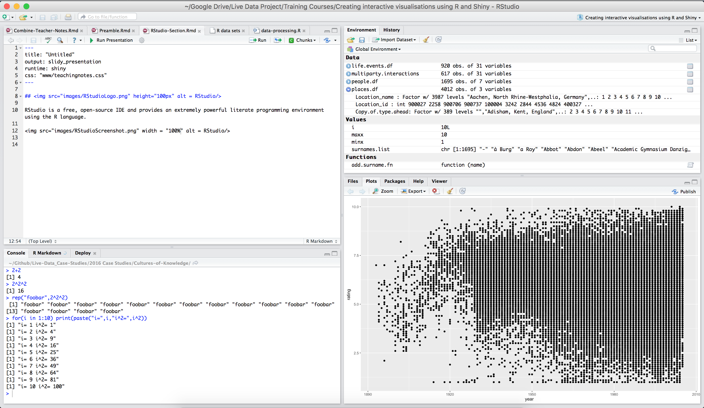

## 

RStudio is a free, open-source IDE that provides an extremely powerful literate programming environment for using the R language.

Literate programming environments gives programmers the freedom to write their code in a human understandable manner - allowing the programmer's approach to the problem to be embedded into the code.

In modern environments like RStudio, a literate programmer is able to include explanatory text, input and output code, images and even interactive elements.

## Reproducability

Reproducability is a hot topic in research today, though the buzzwords Open Access and Open Data are usually used in its place.

Literate programming environments like RStudio are a boon to reproducable scripting practices.

When writing code always consider whether the operation you're encoding might be performed again in future, or could be generalised. The following steps will help:

- Always write comments
- Try to always convert scripts into functions
- Always test code
- Don't code if you don't need to

## Projects

RStudio has a great "projects" feature that makes it easy to contain code, data and output together in a structured manner.

Projects are very useful when working on multiple or long-term projects. In the exercises after this you will create your own projects and become more familiar with the RStudio interface, but the following features of the projects functionality should be highlighted before you start:

- RStudio attempts to save session info when you quit
- Projects provide a sensible location for these files to be saved and are reloaded whenever a project is opened

Scripting environments depend on the user specifying file locations for import/export, to make this easier most user will specify a "working directory" allowing only file names to be specified.

- Projects save the last specified working directory in .RHistory
- When re-opened, projects will update the working directory of the session to what was last used in the project

Note that in our training course there will be some additional complexities as RStudio is being run from a USB.

## Exercises (20mins)

These exercises will assist in you in becomming familiar with RStudio Projects and ensure you have the necessary understanding of the R language to build Shiny apps later in the course.

