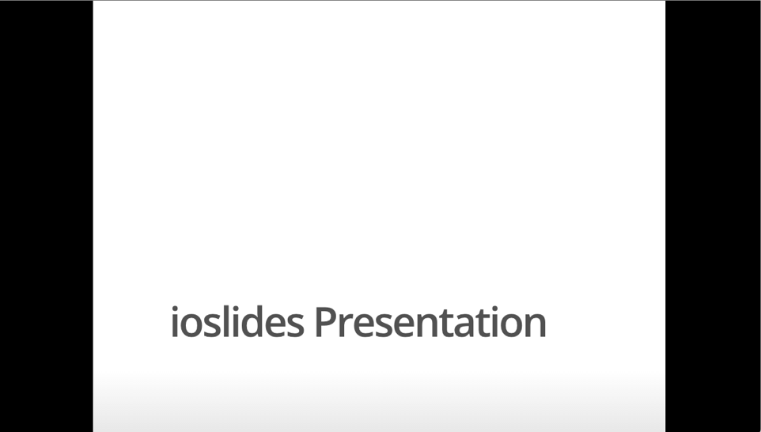
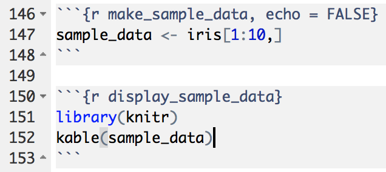

# Literate programming

Literate programming environments try to minimise the potential for undocumented/write-only code by providing a simple method of combining text, images and other output to completely explain the function of the code alongside the code.

# Literate programming: RMarkdown

RStudio provides an amazing literate programming environment in the form of RMarkdown. A simple document-orientated approach to coding that allows even htmlwidgets to be included directly alongside code.

There are three different kinds of document that can be created with RMarkdown:

<center></center>

- PDF files are useful for when writing academic reports, lecture notes or other material that must be printed
- HTML files are useful when wanting to share your content online, perhaps via RPubs which will be discussed later
- Generating word files from RMarkdown is beyond the scope of this course

All of the materials for this training course were written in RMarkdown.

# What is Markdown?

Markdown is a very simple and widely used markup language - it allows documents to be described and then generated through an interpreter.

There are only about 7 things that you can do with Markdown:

- Headings
- Lists
- Italics
- Bold
- Links
- Tables

Every *flavour* of Markdown has slightly different implementations, let us introduce how to create an RMarkdown file first.

# Presentations with RMarkdown

This course focuses on presentations rather than reports, as reports are traditionally printed materials that wouldn't be suitable for `htmlwidgets` or interactive Shiny apps.

There are three types of presentations you can create:





<!-- <div class="row"> -->
<!--   <div class="col-sm-3"></div> -->
<!--   <div class="col-sm-9">Beamer outputs a PDF file with buttons that can be used in most PDF viewers for navigating through slides.</div> -->
<!-- </div>  -->
<!-- <div class="row" style=style="align-items:center;"> -->
<!--   <div class="col-sm-3"></div> -->
<!--   <div class="col-sm-9" style="align-items:center;">ioslides outputs a highly stylised HTML file with a transition effect between slides and a "letter boxing" effect around your content. -->
<!--   Contents can be shown by pressing the C key</div> -->
<!-- </div>  -->
<!-- <div class="row"> -->
<!--   <div class="col-sm-3"></div> -->
<!--   <div class="col-sm-9">slidy outputs a HTML file with significantly more flexibility than ioslides. -->
<!--   Contents can be shown by pressing the C key.</div> -->
<!-- </div>  -->


# Markdown Syntax

There are many different flavours of Markdown but they all share the same basic syntax, which can be spit into the following types of actions:

- Laying out documents

- Formatting Text

- Including images and hyperlinks

- Include code and code output

# Laying out documents

The preamble of RMarkdown documents specifies the overall layout of the document (i.e. slidy or ioslides), the only other layout directly controllable with Markdown is *headings*

\# Heading

\#\# Subheading (New Slide)

\#\#\# Subsubheading

# Formatting Text

Basic text formatting is achieved using syntax that you may have used in other text editors, or in comment sections on websites:

\*italics\*

\*\*bold\*\*

Bullet point and enumerated lists are also added easily:

\- Bullet point 1

\- Bullet point 2

1. First Numbered Item

2. Second Numbered Item

It's important to remember that as your text is first interpreted as code, rather than text to display, it's necessary to "escape" characters that would otherwise be interpreted - for instance \\\*this isn't italic\\\*

# URLS and Images

URL links are simply written as

`[text to show](http://google.com)`

Images can be embedded into RMarkdown documents from the web or from your local machine - the exercises will introduce you to the relative filepaths necessary to include local files

``

# HTML for Power Users

Markdown is great for quickly specifying your document/presentation layout, but it is not designed to be flexible or extensible - it's a minimal set of instructions for styling your content.

If you're generating HTML from RMarkdown it's possible to simply write HTML directly in your .rmd files.

Slidy and ioslides both utilise the Bootstrap CSS so it's easy to include responsive content in your presentations.

# Code Chunks

Code can be inserted into RMarkdown files in one of two ways: inline or as code chunks.

Code to be shown (but not evaluated) is written as \` 2+2 \` - to evaluate code use \` r 2+2 \`

Code chunks are deliminated as follows:

<center></center>

# Naming Chunks and Chunk Options

Naming code chunks make it easier to diagnose issues with the knitting of your RMarkdown documents into HTML or PDF files.

Chunk names are given as follows:

<center></center>

# htmlwidgets in RMarkdown

Provided that your RMarkdown document is a HTML document, there is ***nothing*** special you must do to insert htmlwidgets into a document:

```{r}
library(leaflet)
leaflet() %>%
  addTiles()
```

# RPubs

[RPubs.com](rpubs.com) is a free and open platform for publishing and sharing HTML RMarkdown documents with others.

RPubs and Shiny are both maintained by the team behind RStudio and are fully integrated into the IDE.

Note that while documents hosted on RPubs are made public, the underlying code/.rmd files cannot be downloaded by others.

# Exercises (20 mins)

